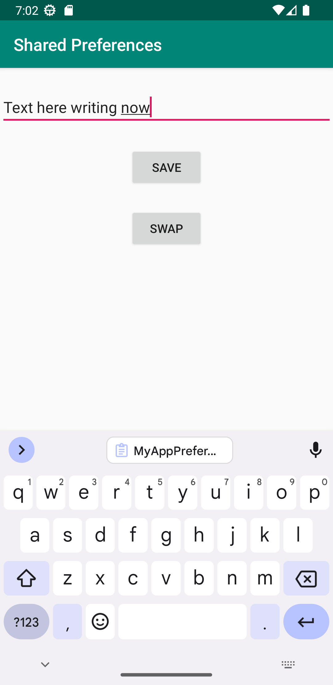
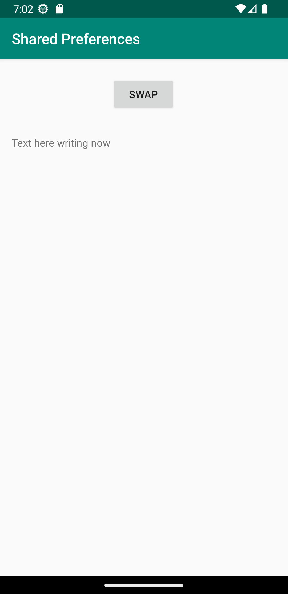

# Rapport
MainActivity was set up to read shared preferences on creation, and setting it to a textView. A button and onClick event was created to be able to swap activities. 
SecondActivity was created and set up with an EditText view which writes to shared preferences when "save" button is pressed through a "savePref" method.
Another button was created to swap back to MainActivity. 


```
public class MainActivity extends AppCompatActivity implements View.OnClickListener{

    private SharedPreferences myPreferenceRef;
    private Button button;
    private TextView prefTextRef;

    @Override
    protected void onCreate(Bundle savedInstanceState) {
        super.onCreate(savedInstanceState);
        setContentView(R.layout.activity_main);
        Toolbar toolbar = findViewById(R.id.toolbar);
        setSupportActionBar(toolbar);

        myPreferenceRef = getSharedPreferences("MyAppPreferenceString",MODE_PRIVATE);

        prefTextRef = new TextView(this);
        prefTextRef = findViewById(R.id.prefText);

        prefTextRef.setText(myPreferenceRef.getString("MyAppPreferenceString", "No preference found."));

        button = findViewById(R.id.goToSecond);
        button.setOnClickListener(MainActivity.this);

    }

    @Override
    public void onClick(View view) {
        Intent intent = new Intent(MainActivity.this, SecondActivity.class);
        startActivity(intent);
    }
    
}

------|

public class SecondActivity extends AppCompatActivity implements View.OnClickListener{

    private SharedPreferences myPreferenceRef;
    private SharedPreferences.Editor myPreferenceEditor;
    private EditText newPrefText;
    private Button button;

    @Override
    protected void onCreate(Bundle savedInstanceState) {
        super.onCreate(savedInstanceState);
        setContentView(R.layout.activity_second);

        // Get a reference to the shared preference
        myPreferenceRef = getSharedPreferences("MyAppPreferenceString",MODE_PRIVATE);
        myPreferenceEditor = myPreferenceRef.edit();

        newPrefText = new EditText(this);
        newPrefText = findViewById(R.id.settingseditview);

        button = findViewById(R.id.goToFirst);
        button.setOnClickListener(SecondActivity.this);

    }

    @Override
    public void onClick(View view) {
        Intent intent = new Intent(SecondActivity.this, MainActivity.class);
        startActivity(intent);

    }

    public void savePref(View view){
        // Store the new preference
        myPreferenceEditor.putString("MyAppPreferenceString", newPrefText.getText().toString());
        myPreferenceEditor.apply();

        // Clear the EditText
        newPrefText.setText("");

    }

------|activity_main.xml

    <TextView
        android:id="@+id/prefText"
        android:layout_width="match_parent"
        android:layout_height="wrap_content"
        android:layout_below="@+id/goToSecond"
        android:layout_marginStart="16dp"
        android:layout_marginLeft="16dp"
        android:layout_marginTop="32dp"
        android:layout_marginEnd="16dp"
        android:layout_marginRight="16dp"
        app:layout_constraintEnd_toEndOf="parent"
        app:layout_constraintStart_toStartOf="parent"
        app:layout_constraintTop_toBottomOf="@+id/goToSecond" />

    <Button
        android:id="@+id/goToSecond"
        android:layout_width="wrap_content"
        android:layout_height="wrap_content"
        android:layout_marginTop="24dp"
        android:text="@string/swap"
        app:layout_constraintBottom_toTopOf="@+id/prefText"
        app:layout_constraintEnd_toEndOf="parent"
        app:layout_constraintHorizontal_bias="0.498"
        app:layout_constraintStart_toStartOf="parent"
        app:layout_constraintTop_toBottomOf="@id/appBarLayout" />

------|activity_second.xml

<?xml version="1.0" encoding="utf-8"?>
<androidx.constraintlayout.widget.ConstraintLayout xmlns:android="http://schemas.android.com/apk/res/android"
    xmlns:app="http://schemas.android.com/apk/res-auto"
    xmlns:tools="http://schemas.android.com/tools"
    android:layout_width="match_parent"
    android:layout_height="match_parent"
    tools:context=".SecondActivity">

    <Button
        android:id="@+id/prefButton"
        android:layout_width="wrap_content"
        android:layout_height="wrap_content"
        android:layout_marginTop="24dp"
        android:onClick="savePref"
        android:text="@string/save"
        app:layout_constraintEnd_toEndOf="parent"
        app:layout_constraintStart_toStartOf="parent"
        app:layout_constraintTop_toBottomOf="@+id/settingseditview" />

    <Button
        android:id="@+id/goToFirst"
        android:layout_width="wrap_content"
        android:layout_height="wrap_content"
        android:layout_marginTop="24dp"
        android:text="@string/swap"
        app:layout_constraintEnd_toEndOf="parent"
        app:layout_constraintStart_toStartOf="parent"
        app:layout_constraintTop_toBottomOf="@+id/prefButton" />

    <EditText
        android:id="@+id/settingseditview"
        android:layout_width="match_parent"
        android:layout_height="wrap_content"
        android:layout_marginTop="24dp"
        app:layout_constraintBottom_toTopOf="@+id/prefButton"
        app:layout_constraintEnd_toEndOf="parent"
        app:layout_constraintHorizontal_bias="0.0"
        app:layout_constraintStart_toStartOf="parent"
        app:layout_constraintTop_toTopOf="parent" />


</androidx.constraintlayout.widget.ConstraintLayout>

------|strings.xml

    <string name="save">save</string>
    <string name="swap">swap</string>
    
------|

dependencies {
    implementation 'androidx.appcompat:appcompat:1.1.0'
    implementation 'androidx.constraintlayout:constraintlayout:1.1.3'
    implementation 'com.google.android.material:material:1.1.0'
    implementation "androidx.preference:preference-ktx:1.1.0"
    implementation 'androidx.preference:preference:1.1.0'
}
```



